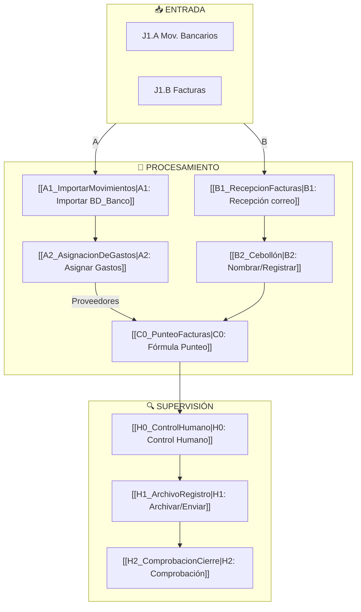

# 🎯 MOC — Sistema Financiero Norgenic

> **Mapa de Contenidos Central**. Este documento es el hub principal para navegar toda la documentación del sistema de gestión financiera de Norgenic. Usa los links para explorar diferentes aspectos del proyecto.

## 📊 Visión General

El sistema de gestión financiera de Norgenic automatiza la conciliación bancaria, asignación de gastos y validación de facturas a través de un pipeline integrado de:

- **Bases de Datos** en Google Sheets
- **Workflows de orquestación** en n8n
- **Scripts de automatización** en Google Apps Script y Python

---

## 🗺️ Estructura de Navegación

### 📋 1. Arquitectura & Flujos

| Documento | Descripción |
|-----------|-------------|
| [[01_Arquitectura_General]] | Visión general del flujo de datos y arquitectura del sistema |
| [[02_Flujo_Datos_Diagrama]] | Diagramas Mermaid del flujo de datos (BD y flujos A/B) |
| [[03_BDs_Principales]] | Documentación de bases de datos: BD_Banco y BD_Facturas |

### 🔧 2. Componentes del Sistema

**Flujo A — Importación y Clasificación Bancaria**
- [[A1_ImportarMovimientos]] → Importación de movimientos bancarios
- [[A2_AsignacionDeGastos]] → Clasificación y asignación de costes

**Flujo B — Procesamiento de Facturas**
- [[B1_RecepcionFacturas]] → Recepción y nombrado de facturas
- [[B2_Cebollón]] → Registro y pre-archivado

**Flujo C — Conciliación**
- [[C0_PunteoFacturas]] → Matching automático (soft-trigger)

**Flujo H — Control Humano**
- [[H0_ControlHumano]] → Validación y supervisión
- [[H1_ArchivoRegistro]] → Archivo y registro de facturas
- [[H2_ComprobacionCierre]] → Verificación y cierre

### 🤖 3. Workflows n8n

| Workflow | Component | Estado |
|----------|-----------|--------|
| [[wf_A1_ImportarMovimientos]] | A1 | Activo |
| [[wf_A2_AsignacionDeGastos]] | A2 | Activo |
| [[wf_B1_GmailMetralleta]] | B1 | Activo |
| [[wf_B2_Cebollon]] | B2 | Activo |
| [[wf_C0_PuntearFacturas]] | C0 | Activo |
| [[wf_C1_ReenvioFacturas]] | H1 | Activo |
| [[wf_C2_ComprobacionFacturas]] | H2 | Activo |

### 📊 4. Datos & Métricas

- [[KPIs_Sistema]] → Indicadores clave de rendimiento para cada componente
- [[Metricas_Detalladas]] → Análisis profundo de cómo medir cada KPI
- [[Metricas_Importacion]] → KPIs de A1
- [[Metricas_Asignacion]] → KPIs de A2
- [[Metricas_Facturas]] → KPIs de B1/B2
- [[Metricas_Punteo]] → KPIs de C0
- [[Metricas_Control]] → KPIs de H0/H2
- [[Metricas_Archivado]] → KPIs de H1
- [[Metricas_Globales]] → Ciclo completo

### 🔢 5. Fórmulas & Código

- [[Formulas_Google_Sheets]] → Referencia de fórmulas principales
- [[Scripts_GoogleAppsScript_Referencia]] → Índice y mapeo de todos los scripts GAS
- [[Scripts_AppScripts]] → Google Apps Scripts (importación, archivado)
- [[Scripts_Python]] → Scripts Python (alternativas, herramientas)

### 🛠️ 5.1 Documentación Técnica de Componentes

- [[ConstantesGlobales]] → Variables globales compartidas (detalles y optimización)
- [[A1_ImportarMovimientos_Implementacion]] → Detalles GAS de A1 (UID, deduplicación, flujo)
- [[H1_ArchivoRegistro_Implementacion]] → Detalles GAS de H1 (archivado, idempotencia)
- [[A2_AsignacionDeGastos_Implementacion]] → [Próximo]
- [[C0_PunteoFacturas_Implementacion]] → [Próximo]

### 🔗 5.2 Trazabilidad & Referencias

- [[Trazabilidad_Codigo_Documentacion]] → Mapeo bidireccional código ↔ documentación
- [[Informes_Sesiones_Tecnicas]] → Debugging y optimización (informes de sesiones)
- [[Scripts_GoogleAppsScript_Referencia]] → Índice de scripts y versiones

### 💡 6. Mejoras & Roadmap

- [[Propuestas_Mejora]] → Sugerencias y mejoras pendientes
- [[Roadmap_Desarrollo]] → Próximos pasos y evolución del sistema

---

## 🔄 Relaciones Principales

---

## 🎯 Cómo Usar Este MOC

1. **Para entender la arquitectura general**: Comienza en [[01_Arquitectura_General]]
2. **Para profundizar en un componente específico**: Navega a través de la sección "Componentes del Sistema"
3. **Para ver flujos específicos**: Consulta [[02_Flujo_Datos_Diagrama]]
4. **Para entender un workflow n8n**: Busca en la sección "Workflows n8n"
5. **Para metricas y KPIs**: Ve a [[KPIs_Sistema]]
6. **Para mejoras y optimizaciones**: Consulta [[Propuestas_Mejora]]

---

## 📝 Notas de Mantenimiento

- **Última actualización**: 2026-09-10
- **Versión de arquitectura**: 3.1
- **Responsable**: Norgenic Finance Team
- Todos los documentos están linkados con `[[wiki-links]]` para máxima navegabilidad
- Cada componente tiene referencias cruzadas a workflows, KPIs y fórmulas relacionadas

---

## 🔗 Enlaces Rápidos

- [[01_Arquitectura_General|→ Ir a Arquitectura General]]
- [[KPIs_Sistema|→ Ir a KPIs]]
- [[Formulas_Google_Sheets|→ Ir a Fórmulas]]
