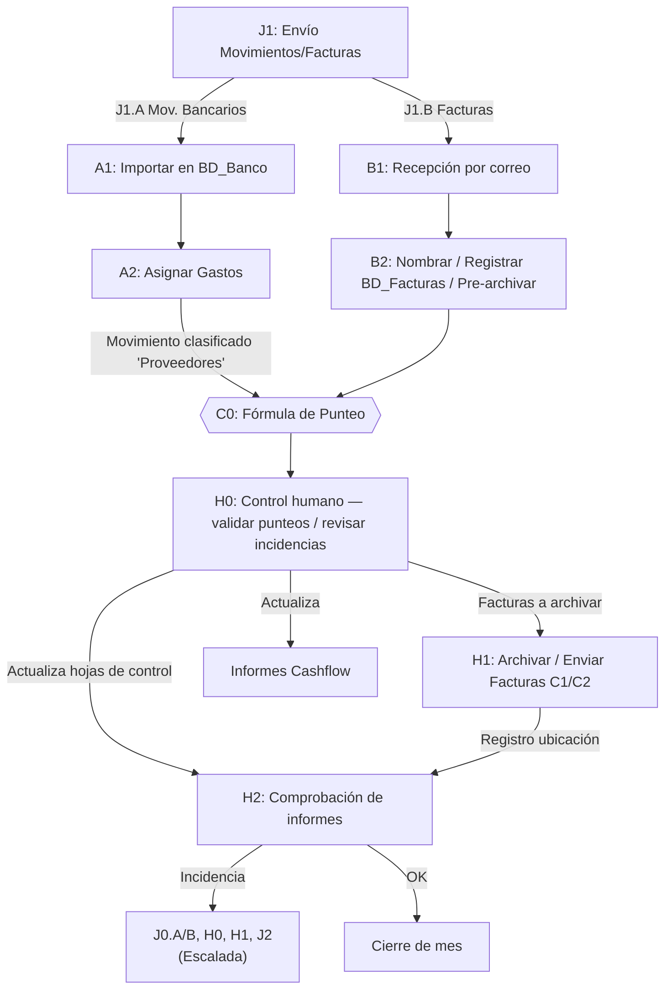
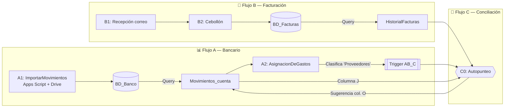
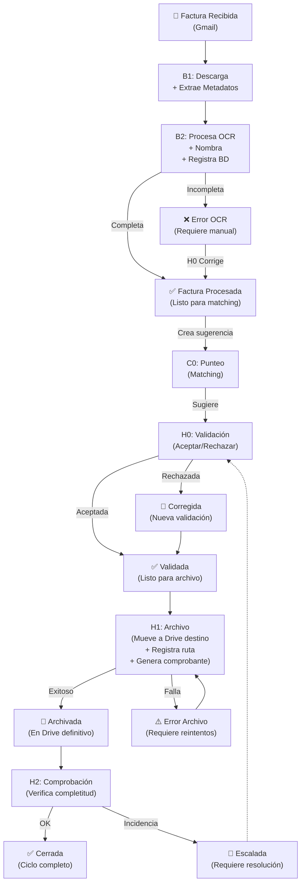
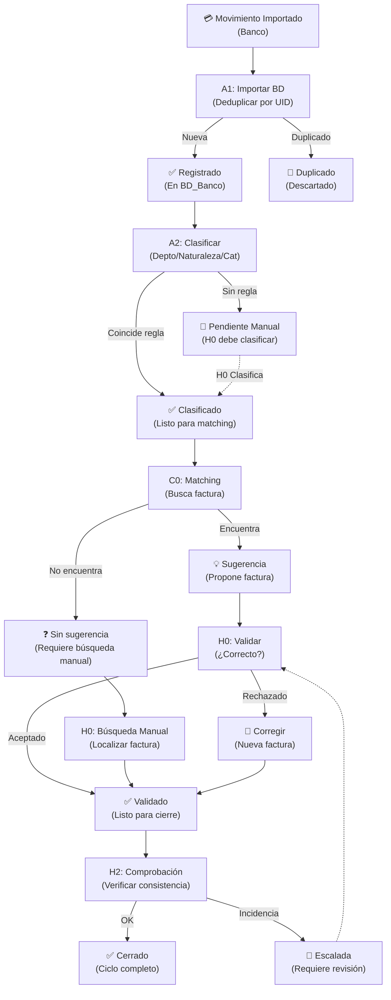
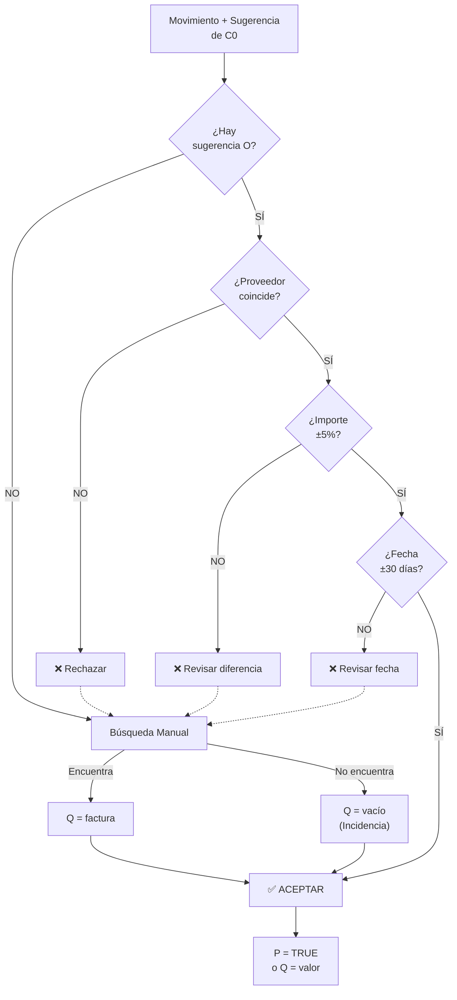
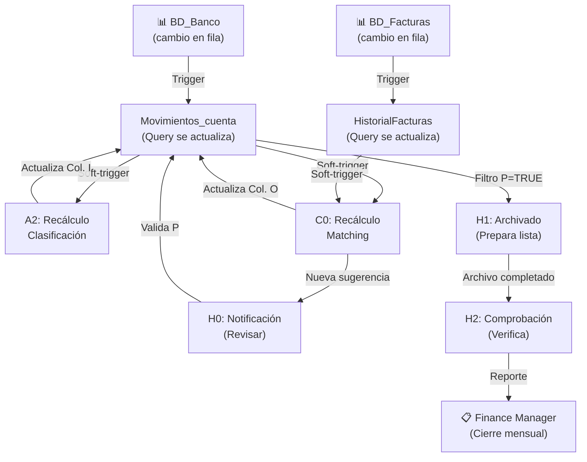

# Flujo de Datos — Diagramas Detallados

## 🖼️ Diagrama 1: Flujo de Datos de la BD (Reconstrucción)

Las tres hojas superiores actúan como "soft-trigger" que inician un tratamiento de datos en cascada.

---

## 🖼️ Diagrama 2: Flujo de Datos — Arquitectura Flujo A / Flujo B

Separación clara entre procesamiento bancario y facturación, convergentes en C0.

---

## 🖼️ Diagrama 3: Estados de una Factura

Ciclo de vida completo de una factura desde recepción hasta archivo.

---

## 🖼️ Diagrama 4: Estados de un Movimiento Bancario

Paralelo al ciclo de factura, pero desde la perspectiva del movimiento.

---

## 🖼️ Diagrama 5: Flujo de Decisiones en H0 (Control Humano)

Detalle de la lógica de decisión que ejecuta H0.

---

## 🖼️ Diagrama 6: Triggers y Cascadas (Soft-Triggers)

Cómo los cambios en una hoja disparan cálculos en cascada.

---

## 🔗 Notas Relacionadas

- [[01_Arquitectura_General]] - Overview arquitectura
- [[A1_ImportarMovimientos]] - Detalle Flujo A inicial
- [[B1_RecepcionFacturas]] - Detalle Flujo B inicial
- [[C0_PunteoFacturas]] - Detalle Flujo C matching
- [[H0_ControlHumano]] - Detalle control y decisiones
- [[H1_ArchivoRegistro]] - Detalle archivo
- [[H2_ComprobacionCierre]] - Detalle cierre

---

**Última actualización**: 2026-09-10
**Versión**: 3.1
