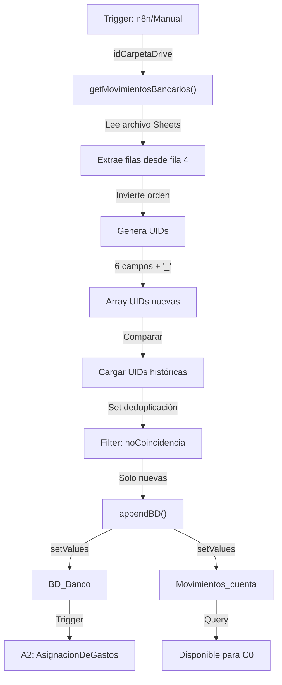

# A1 — Implementación Técnica

## 🎯 Propósito

Este documento detalla cómo se implementa el componente A1 (Importar Movimientos Bancarios) usando Google Apps Script (GAS). Vincula el código con la documentación conceptual de [[A1_ImportarMovimientos]].

---

## 📂 Archivos de Referencia

| Archivo | Propósito |
|---------|-----------|
| `importarMovimientos.gs` | Función principal de importación (versión 1) |
| `importarMovimientosV2.gs` | Función mejorada de importación (versión optimizada) |
| `ConstantesGlobales.gs` | Variables globales compartidas |

---

## ⚙️ Flujo de Ejecución

### Paso 1: Configurar Variables Globales

```javascript
let idCarpetaDrive = "1QL47EotyHLz4xhEssWw_MWIAvqDKcsg1" 
// Carpeta en Drive donde están los extractos bancarios

let filaInicioDatosImportados = 4 
// Fila donde empieza el contenido real (fila 1-3 = encabezados)

let sheetBDB_Range = sheetBDB.getRange(1,1,sheetBDB.getLastRow(),sheetBDB.getLastColumn()).getValues()
// Rango completo de BD_Banco histórica

let sheetBDB_RangeUIDs = sheetBDB.getRange(1,1,sheetBDB.getLastRow(),1).getValues()
// Columna de UIDs del histórico (para deduplicación)

let folderMovimientosBancarios = DriveApp.getFolderById(idCarpetaDrive)
// Referencia a carpeta de Drive
```

**Notas**:
- `idCarpetaDrive` debe actualizarse si cambia la ubicación de extractos
- `filaInicioDatosImportados` varía por banco (algunos tienen 2-3 líneas de encabezado)

---

### Paso 2: Obtener Movimientos Bancarios

```javascript
function getMovimientosBancarios(){
  // 1. Leer archivos de tipo Google Sheets en carpeta
  var listMovim = folderMovimientosBancarios.getFilesByType("application/vnd.google-apps.spreadsheet");
  var file = listMovim.next();
  var fileId = file.getId();
  
  // 2. Abrir spreadsheet del archivo
  var fileInfo = SpreadsheetApp.openById(fileId);
  var fileSheet = fileInfo.getSheetById(fileInfo.getSheetId());
  
  // 3. Extraer contenido desde fila de inicio hasta última fila
  var fileContent = fileSheet.getRange(
    filaInicioDatosImportados, 
    1, 
    fileSheet.getLastRow(), 
    fileSheet.getLastColumn()
  ).getValues();
  
  // 4. Invertir orden (más recientes primero)
  var inverseBD = [...fileContent];
  inverseBD = inverseBD.filter(row => row[0] !== ""); // Eliminar filas vacías
  inverseBD = inverseBD.reverse();
  
  return inverseBD; // Array de movimientos invertido
}
```

**Proceso**:
- Lee **cualquier archivo Sheets** en la carpeta (sin especificar nombre)
- Toma última línea con contenido como límite
- Invierte orden (útil para procesamiento descendente)
- Filtra filas vacías

**Limitación actual**: Solo procesa **1 archivo** por ejecución (`.next()`)

---

## 🔐 Generación de UID (Deduplicación)

### Algoritmo de UID

```javascript
const uids = inverseBD.map(row => [
  // Fecha Valor (col 0) → formato DD/MM/YYYY
  row[0] ? `${new Date(row[0]).getDate().toString().padStart(2, '0')}/${...}` : '',
  
  // Fecha Operación (col 1) → formato DD/MM/YYYY
  row[1] ? `${new Date(row[1]).getDate().toString().padStart(2, '0')}/${...}` : '',
  
  // Concepto/Proveedor (col 2) → trim spaces
  (row[2] || '').trim(),
  
  // Más Datos (col 3) → trim spaces
  (row[3] || '').trim(),
  
  // Importe Debe (col 4) → convertir , por . como separador decimal
  row[4] ? row[4].toString().replace(/,/g, '').replace(/\./g, ',') : '',
  
  // Importe Haber (col 5) → convertir , por . como separador decimal
  row[5] ? row[5].toString().replace(/,/g, '').replace(/\./g, ',') : ''
  
].join("'_'"));
```

### Estructura de UID

```
UID_Estructura = [FechaValor]'_'[FechaOp]'_'[Proveedor]'_'[MoreData]'_'[Debe]'_'[Haber]

Ejemplo:
15/09/2026'_'15/09/2026'_'AMAZON EU'_'Compra online'_'49,99'_''
```

### Detalles Técnicos

| Componente | Descripción | Formato |
|-----------|-------------|---------|
| **FechaValor** | Fecha en la que se contabiliza | `DD/MM/YYYY` |
| **FechaOp** | Fecha de operación | `DD/MM/YYYY` |
| **Proveedor** | Nombre del movimiento | Sin trim inicial |
| **MasData** | Descripción adicional | Sin trim inicial |
| **Debe/Haber** | Importes | Coma como decimal (formato ES) |

**Separador**: `'_'` (comilla-guión-comilla para evitar conflictos)

### Ventajas del UID

✅ **Único**: Combinación de 6 campos hace colisiones casi imposibles
✅ **Portable**: Se puede usar para sincronizar con BD_Facturas
✅ **Legible**: Fácil debuggear qué movimiento es cuál
✅ **Ignorable**: Espacios no afectan (trim aplicado)

### Riesgos Conocidos

⚠️ **Cambio de formato de banco** → UID diferentes
- Solución: Regenerar UIDs históricos o reconfigurar validación

⚠️ **Errores de tipeo en proveedor** → UID diferentes
- Solución: Validar proveedor antes de importar

⚠️ **Conversión de decimales** → UID diferentes si formato varía
- Solución: Usar siempre formato español (coma decimal)

---

## 🗂️ Deduplicación en BD_Banco

```javascript
function appendBD(){
  // 1. Obtener movimientos a importar (con UIDs)
  let arrayImportadosUID = getMovimientosBancarios();
  
  // 2. Construir Set de UIDs históricos (O(1) lookup)
  let historicoUIDs = new Set(sheetBDB_RangeUid.map(row => row[0]));
  
  // 3. Filtrar solo movimientos nuevos (no en histórico)
  let noCoincidencia = arrayImportadosUID.filter(row => !historicoUIDs.has(row[0]));
  
  // 4. Preparar datos sin columna UID
  let noCoincidenciaImportar = noCoincidencia.map(row => row.slice(0));
  
  // 5. Append en BD_Banco
  let importarEnHistorico = sheetBDB.getRange(
    sheetBDB.getLastRow()+1, 
    1, 
    noCoincidenciaImportar.length, 
    noCoincidenciaImportar[0].length
  ).setValues(noCoincidenciaImportar);
  
  // 6. Append en Movimientos_cuenta (copia)
  let importarEnMovimientos = sheet_Mov.getRange(
    sheet_Mov.getLastRow()+1, 
    1, 
    noCoincidenciaImportar.length, 
    noCoincidenciaImportar[0].length
  ).setValues(noCoincidenciaImportar);
}
```

### Proceso Paso a Paso

```
1. Obtener UIDs nuevas
   arrayImportadosUID = [UID1, UID2, UID3, ...]
   
2. Cargar UIDs históricas en Set (más rápido)
   historicoUIDs = {UID_vieja1, UID_vieja2, ...}
   
3. Comparar (O(n) tiempo lineal)
   noCoincidencia = [UID2, UID3] // solo las nuevas
   
4. Agregar a BD_Banco
   sheetBDB.getRange(lastRow+1, ...).setValues(noCoincidencia)
   
5. Copiar en Movimientos_cuenta (para queries)
   sheet_Mov.getRange(lastRow+1, ...).setValues(noCoincidencia)
```

### Rendimiento

| Operación | Complejidad | Notas |
|-----------|------------|-------|
| Leer archivos Drive | O(1) | Solo 1 archivo |
| Generar UIDs | O(n) | Donde n = filas nuevas |
| Crear Set histórico | O(m) | Donde m = filas históricas |
| Deduplicación | O(n) | Set.has() es O(1) |
| Append en BD | O(n) | Llamada única a setValues() |

**Optimización**: Usar `Set` en lugar de `Array.includes()` reduce tiempo de O(n×m) a O(n+m)

---

## 🐛 Errores Potenciales

### Error 1: Rango lastRow+1 fuera de límites

```javascript
// ❌ Puede fallar si sheet tiene validaciones en fila lastRow+1
let importarEnHistorico = sheetBDB.getRange(
  sheetBDB.getLastRow()+1,  // Riesgo: no hay más filas
  1, 
  noCoincidenciaImportar.length, 
  noCoincidenciaImportar[0].length
).setValues(noCoincidenciaImportar)
```

**Solución**: 
- Aumentar número de filas en sheet (Insert → rows)
- O validar que `lastRow+1` está disponible

### Error 2: Columnas adicionales en importación

```javascript
// ❌ Si nuevo archivo tiene más columnas que histórico
var fileContent = fileSheet.getRange(
  filaInicioDatosImportados, 
  1, 
  fileSheet.getLastRow(), 
  fileSheet.getLastColumn()  // Puede ser > 6 columnas
).getValues();
```

**Solución**:
- Especificar número exacto de columnas
- Validar estructura de archivo antes de importar

### Error 3: Encoding de caracteres especiales

```javascript
// ❌ Caracteres latinos (ñ, á, é) pueden afectar UID
(row[2] || '').trim()  // Si "TELÉFONICA" vs "TELEFONICA"
```

**Solución**:
- Normalizar caracteres antes de UID
- Usar `String.prototype.normalize()`:
  ```javascript
  (row[2] || '').trim().normalize("NFD").replace(/[\u0300-\u036f]/g, "")
  ```

---

## 📊 Métricas de Éxito

Según [[Metricas_Detalladas]] sección 1:

| Métrica | KPI |
|---------|-----|
| **Tasa importación correcta** | >99% |
| **Tasa incidencias formato** | <5% |
| **Duplicados no detectados** | <1% |
| **Filas vacías residuales** | <1% |

**Cómo medir**:
```javascript
// Agregar al final de appendBD()
let tasaExito = (noCoincidencia.length > 0) ? 
  ((noCoincidenciaImportar.length / arrayImportadosUID.length) * 100) : 100;
Logger.log(`Tasa importación: ${tasaExito}%`);
```

---

## 🔄 Flujo Completo en Diagrama



---

## 🛠️ Debugging

### Habilitar Logs Detallados

```javascript
// Descomentar en getMovimientosBancarios()
Logger.log("Carpeta encontrada: " + folderMovimientosBancarios.getName());
Logger.log("Archivo: " + file.getName());
Logger.log("Contenido leído: " + fileContent.length + " filas");
Logger.log("Después invertir: " + inverseBD.length + " filas");
Logger.log("Primeras 5 UIDs: " + uids.slice(0,5));

// Descomentar en appendBD()
Logger.log("UIDs nuevas: " + arrayImportadosUID.length);
Logger.log("UIDs históricas: " + historicoUIDs.size);
Logger.log("UIDs a importar: " + noCoincidencia.length);
```

### Ver Ejecuciones

1. Editor Google Apps Script → Executions
2. Buscar función `appendBD`
3. Ver logs en "Logs" panel

---

## 📝 Versiones

| Versión | Cambios | Estado |
|---------|---------|--------|
| **V1** | `importarMovimientos.gs` | ✅ Funcional |
| **V2** | `importarMovimientosV2.gs` | ✅ Optimizado |

**Diferencias V1 vs V2**:
- V2 probablemente tiene mejor manejo de errores
- V2 posible mejora de rendimiento en deduplicación
- (Requiere revisar archivo completo para detalle)

---

## 🔗 Notas Relacionadas

- [[A1_ImportarMovimientos]] → Descripción conceptual de A1
- [[Formulas_Google_Sheets]] → Fórmulas de Google Sheets relacionadas
- [[03_BDs_Principales]] → Estructura de BD_Banco
- [[ConstantesGlobales]] → Variables compartidas
- [[Metricas_Detalladas]] → KPIs de A1 (sección 1)
- [[Workflows_n8n_Referencia]] → Flujo n8n que triggeriza A1

---

**Última actualización**: 2026-09-10
**Autor**: Análisis de scripts importarMovimientos.gs / V2
**Responsable técnico**: DevOps / Google Apps Script
**Revisión recomendada**: Mensual (ver logs de ejecución)
