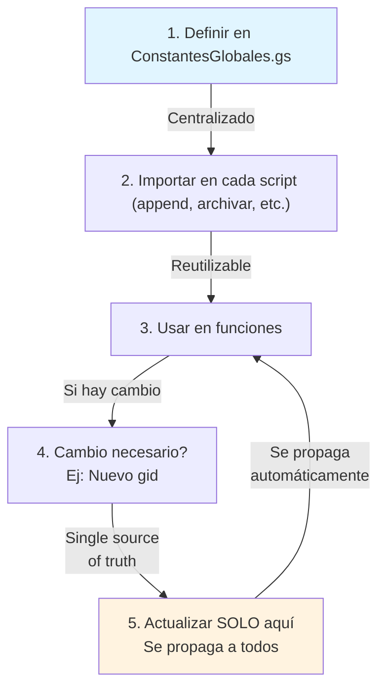

# ConstantesGlobales — Configuración Centralizada

## 🎯 Propósito

Centralizar todas las variables compartidas entre scripts Google Apps Script. Define:
- IDs de Spreadsheets
- GIDs (Sheet IDs) de hojas específicas
- Mapeo de columnas (números a nombres)
- Límites de procesamiento (filas por lote)

---

## ⚠️ Importante: Problema de Rendimiento Identificado

**Ver**: [[Informes_Sesiones_Tecnicas#problema-triple-openbyid-en-constantesglobales]]

El archivo `ConstantesGlobales.gs` tiene un **problema crítico de rendimiento**:
```javascript
// ❌ ACTUAL (3 llamadas caras a openById)
const ss = SpreadsheetApp.openById(ss_id);
const sheetBDB = SpreadsheetApp.openById(ss_id).getSheetById(gid_BDB);  // REPETIDA
const sheet_Mov = SpreadsheetApp.openById(ss_id).getSheetById(gid_Mov); // REPETIDA
```

**Solución**: Usar patrón de inicialización perezosa (lazy loading)
```javascript
// ✅ RECOMENDADO (1 llamada cara + getters)
let _ss = null;
function getSpreadsheet() {
  if (!_ss) _ss = SpreadsheetApp.openById(ss_id);
  return _ss;
}
```

---

## 📍 Estructura de ConstantesGlobales.gs

### Sección 1: IDs de Sheets

```javascript
const ss_id = "1sZeGfiuG7Ab9jx14_-oaQZTtrhIohlx5dhYoSgZCOuw"
const gid_Mov = 1963712436    // Movimientos_cuenta
const gid_BDB = 1089991841    // BD_Banco

const ss = SpreadsheetApp.openById(ss_id);
const sheetBDB = ss.getSheetById(gid_BDB);
const sheet_Mov = ss.getSheetById(gid_Mov);
```

| Variable | Propósito | Valor Ejemplo |
|----------|-----------|---------------|
| `ss_id` | ID del Spreadsheet principal | `1sZeGfiuG7Ab9jx14...` |
| `gid_BDB` | Sheet ID de BD_Banco | `1089991841` |
| `gid_Mov` | Sheet ID de Movimientos_cuenta | `1963712436` |
| `ss` | Objeto Spreadsheet (caché) | Referencia |
| `sheetBDB` | Objeto Sheet de BD_Banco | Referencia |
| `sheet_Mov` | Objeto Sheet de Movimientos | Referencia |

### Sección 2: Mapeo de Columnas en Movimientos_cuenta

```javascript
// Columnas 1-based (como en Google Sheets)
const Mov_UID        = 1;   // A  UID movimiento
const Mov_NOMBREFRA  = 8;   // H  NombreFactura
const Mov_PeriodoCobro  = 9;   // I  PeriodoCobro
const Mov_Decripcion  = 10;  // J  DescripccionMovimiento
const Mov_CFInOut  = 11;     // K  CF in/out
const Mov_CFCategory = 12;   // L  CF category
const Mov_PlataformaPago  = 13;  // M  PlataformaPago
const Mov_DEF_UID    = 14;   // N  Def_UID (fórmula)
const Mov_Autopunteo  = 15;  // O  Autopunteo (C0)
const Mov_VALIDACION = 16;   // P  Inicio bloque manual
const Mov_FRA_MANUAL = 17;   // Q  Fra.Manual
const Mov_PCONABLE   = 18;   // R  P.Conable
const Mov_UBICACION  = 19;   // S  Ubicación VT
const Mov_ID_ENVIADA = 20;   // T  ID_Enviada
const Mov_CARPETA    = 21;   // U  Carpeta
const Mov_BD         = 22;   // V  BD checkbox (trigger)
```

**Notas**:
- Columnas A-N (1-14): Fórmulas que se heredan desde fila 2
- Columnas O-V (15-22): Entrada manual o checkbox para triggers
- `Mov_DEF_UID` (col 14): UID definitiva generada por fórmula
- `Mov_BD` (col 22): Checkbox que inicia proceso de archivado

### Sección 3: Mapeo de Columnas en BD_Banco

```javascript
const BDB_UID        = 1;     // A
const BDB_DEFINITIVO = 8;     // H  — escribir SIEMPRE al final
const BDB_DEF_UID    = 9;     // I  "Def_UID = DUID"
const BDB_PeriodoCobro  = 10;  // J
const BDB_NOMBREFRA  = 11;    // K
const BDB_CFInOut    = 12;    // L
const BDB_CFCategory = 13;    // M
const BDB_PlataformaPago = 14; // N
const BDB_Validacion = 15;    // O  (CO)
```

| Columna | Constante | Propósito |
|---------|-----------|-----------|
| A | `BDB_UID` | UID de importación (generada en A1) |
| H | `BDB_DEFINITIVO` | Checkbox: TRUE = movimiento archivado |
| I | `BDB_DEF_UID` | UID definitiva (después de archivado) |
| J-O | Resto | Datos de clasificación y validación |

**Crítico**: `BDB_DEFINITIVO` se escribe SIEMPRE al final (ver [[H1_ArchivoRegistro_Implementacion#paso-4-volcado-idempotente]])

### Sección 4: Metadatos de Procesamiento

```javascript
const numColsManuales = Mov_BD - Mov_VALIDACION + 1; // 7 columnas (P:V)
const COLUMNAS_FORMULAS = [8, 9, 10, 11, 12, 13, 14, 15]; // Cols H:O con fórmulas
```

---

## ⚙️ Límites de Procesamiento

```javascript
const MAX_FILAS_LOTE = 50
```

**Propósito**: Limitar filas procesadas por ejecución de script

**Justificación**:
- >50 filas → Tiempo ejecución ~2-3 minutos
- >100 filas → Riesgo de timeout (6 minutos máximo en GAS)
- Mejor: Dividir en lotes de 50 filas

**Impacto**:
- H1 procesará máximo 50 movimientos por ejecución
- Si hay 200 validados, requiere 4 ejecuciones de H1
- n8n puede disparar H1 cada minuto para procesar continuamente

---

## 🔄 Ciclo de Vida de Constantes



---

## 🛠️ Cómo Usar en Otros Scripts

### Importar constantes

```javascript
// En importarMovimientos.gs
// Las constantes ya están disponibles globalmente
// No hay import explícito — Apps Script carga ConstantesGlobales.gs primero

function appendBD() {
  let sheetBDB_Range = sheetBDB.getRange(1,1,sheetBDB.getLastRow(),sheetBDB.getLastColumn()).getValues()
  // sheetBDB ya existe porque ConstantesGlobales.gs se ejecutó
}
```

### Agregar nueva constante

```javascript
// Si necesitas agregar nueva constante:
// 1. Agregar en ConstantesGlobales.gs
// 2. Usar inmediatamente en otros scripts (no requiere reload)

// Ejemplo: Nuevo gid para hoja de Facturas
const gid_HistorialFras = 2145883921
const sheetHistFras = ss.getSheetById(gid_HistorialFras)
```

---

## 📊 Performance Impact

### Antes (Problema)

```
Ejecución de appendBD():
  ├─ ConstantesGlobales.gs nivel superior:
  │  ├─ openById(ss_id) ← CALL 1 (cara)
  │  ├─ openById(ss_id).getSheetById(gid_BDB) ← CALL 2 (cara)
  │  ├─ openById(ss_id).getSheetById(gid_Mov) ← CALL 3 (cara)
  │  ├─ getLastColumn() ← CALL 4
  │  └─ getRange().getValues() ← CALL 5+ (lee toda la BD)
  │
  ├─ appendBD.gs nivel superior:
  │  ├─ getRange().getValues() ← CALL 6
  │  └─ DriveApp.getFolderById() ← CALL 7
  │
  └─ Función appendBD() empieza
  
Total: ~90 segundos fijos + tiempo procesamiento
```

### Después (Solución Propuesta)

```
Ejecución de appendBD():
  ├─ ConstantesGlobales.gs nivel superior:
  │  └─ Define getters (sin llamadas)
  │
  ├─ appendBD.gs nivel superior:
  │  └─ Lazy loading (sin llamadas)
  │
  └─ Función appendBD() empieza
     ├─ getSpreadsheet() → openById(ss_id) ← CALL 1 (caché)
     ├─ getSheetBDB() ← CALL 2 (barata, usa caché)
     └─ Resto de procesamiento
  
Total: ~2 segundos fijos + tiempo procesamiento (45x más rápido)
```

---

## 🔐 Cambios Seguros

| Cambio | Riesgo | Solución |
|--------|--------|----------|
| Cambiar `ss_id` | Alto — afecta todos los scripts | Actualizar SOLO aquí, retest todas funciones |
| Cambiar `gid_BDB` | Alto — rompe lectura de BD_Banco | Usar getSheetByName() como fallback |
| Cambiar `MAX_FILAS_LOTE` | Medio — puede causar timeouts | Validar con >100 filas antes de aumentar |
| Agregar columna nueva | Bajo — agregar constante única | Verificar que no existe ya |

---

## 📝 Checklist de Revisión Mensual

- [ ] `ss_id` sigue siendo válido (¿se movió el Spreadsheet?)
- [ ] `gid_BDB` y `gid_Mov` siguen correctos (¿se reorganizó?)
- [ ] `MAX_FILAS_LOTE` es apropiado (¿cambió volumen?)
- [ ] Todas las constantes de columnas están actualizadas
- [ ] No hay columnas duplicadas o conflictivas
- [ ] Rendimiento acceptable (<90 seg overhead)

---

## 🔗 Notas Relacionadas

- [[A1_ImportarMovimientos_Implementacion]] → Usa ConstantesGlobales
- [[H1_ArchivoRegistro_Implementacion]] → Usa ConstantesGlobales
- [[Scripts_GoogleAppsScript_Referencia]] → Referencia de scripts
- [[Informes_Sesiones_Tecnicas]] → Problemas de rendimiento documentados
- [[Trazabilidad_Codigo_Documentacion]] → Mapeo código ↔ doc

---

**Última actualización**: 2026-09-10
**Archivo source**: `workflows/CaixaB$-Scripts/AppScripts/ConstantesGlobales.gs`
**Responsable técnico**: Google Apps Script
**Frecuencia de revisión**: Mensual o ante cambios de estructura
**Estado**: ⚠️ Requiere optimización (lazy loading)
