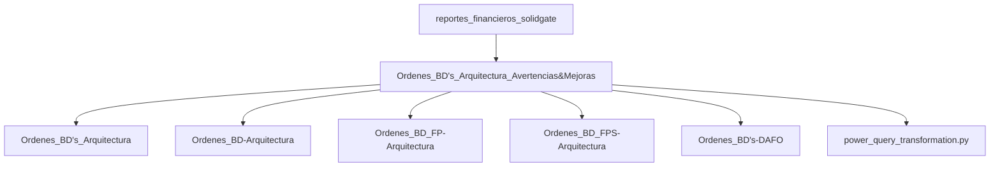

# Advertencias Técnicas, Limitaciones y Oportunidades de Mejora en la Arquitectura

Este documento consolida las advertencias operativas, restricciones técnicas de la plataforma Solidgate y las oportunidades de mejora identificadas a partir de la especificación técnica del reporte de entradas financieras (`[[reportes_financieros_solidgate]]`). 

Su objetivo es servir como guía de buenas prácticas y prevención de errores para el mantenimiento de `[[Ordenes_BD's_Arquitectura]]` y sus tres capas asociadas (`[[Ordenes_BD-Arquitectura]]`, `[[Ordenes_BD_FP-Arquitectura]]` y `[[Ordenes_BD_FPS-Arquitectura]]`).

---

## 1. Advertencias y Riesgos en la Extracción de Datos

### 1.1. Ventana de Desfase de 4 Horas (`created_at`)
* **Mecanismo técnico**: El campo `created_at` registrado en el libro contable de Solidgate presenta una latencia de aproximadamente **4 horas** con respecto al momento real en que se procesa la transacción en la pasarela de pago.
* **Riesgo asociado**: Si la extracción mensual se limita estrictamente al rango `01/MM/AAAA 00:00:00` - `31/MM/AAAA 23:59:59`, las transacciones ocurridas en las últimas 4 horas del mes quedarán excluidas de la descarga del mes en curso y aparecerán en la del mes siguiente.
* **Medida correctora / Regla de Extracción**:
  1. Al solicitar o descargar el reporte mensual, ampliar el rango final **4 horas hacia el día siguiente** (ej. hasta las `04:00:00` del día 1 del mes posterior).
  2. Aplicar un filtrado estricto local en Power Query o Python utilizando las columnas `accounting_date` o `transaction_datetime_utc`.

### 1.2. Generación Fragmentada por Canales (*Channels*)
* **Mecanismo técnico**: Al exportar datos desde el Hub o API seleccionando múltiples canales de venta, Solidgate no compila un único archivo unificado, sino que genera **un CSV independiente por cada canal**.
* **Impacto en el pipeline**: Explica de forma directa por qué la carpeta mensual de ingesta (`/Finance/Año/MES/Data/`) contiene múltiples archivos de datos para un solo período.
* **Riesgo asociado**: Si se añade un nuevo canal en Solidgate y no se deposita su CSV correspondiente en la carpeta del mes, la consolidación en `[[Ordenes_BD_FP-Arquitectura]]` omitirá dicho volumen de ventas sin lanzar un error explícito.

### 1.3. Restricciones de Rango y Expiración S3
* **Límite de extracción**: La API y el Hub imponen un **límite máximo de 36 días** por cada consulta de descarga.
* **Caducidad de enlaces**: Los enlaces de descarga temporales alojados en Amazon S3 generados por Solidgate expiran a los **30 días** (emitiendo un código de estado HTTP 410 *Gone*).
* **Medida correctora**: Los archivos CSV deben descargarse y guardarse localmente en la estructura del repositorio de forma inmediata tras su generación, evitando depender de llamadas dinámicas a URLs antiguas de S3.

---

## 2. Oportunidades de Mejora Arquitectónica

### 2.1. Explotación del Esquema Extendido (27 Columnas)
Actualmente, las bases de datos simplificadas y los Data Marts de conciliación filtran y retienen un subconjunto reducido de columnas (`amount`, `payout_amount`, `record_type_key`, `currency`, `provider`). Sin embargo, la fuente cruda de *Financial Entries* contiene un catálogo enriquecido que permite futuras ampliaciones analíticas sin modificar la ingesta:

| Dimensión Disponible | Aplicación y Valor de Negocio |
| :--- | :--- |
| `geo_country` / `issuing_country` | Permite crear Data Marts para auditoría de tasas de conversión y comisiones por país de origen del comprador vs. país del banco emisor. |
| `payment_method` / `card_brand` | Facilita el desglose de costes financieros y *fees* cobrados por la pasarela según la marca de tarjeta (Visa, Mastercard, AMEX) o método alternativo. |
| `legal_entity` | Permite segregar automáticamente la facturación y conciliación por entidad legal corporativa en estructuras multi-empresa. |
| `product_id` / `product_name` | Habilita el análisis directo de rentabilidad neta (Ventas menos Reembolsos/Chargebacks) a nivel de producto o SKU. |

### 2.2. Automatización Directa de Descargas vía API v1
Para eliminar la carga manual de descarga mensual analizada en `[[Ordenes_BD's-DAFO]]`, se propone automatizar la ingesta directamente mediante el endpoint de Solidgate (`GET /reports/financial-entries-by-date`):

* **Gestión de asincronía**: La llamada a la API devuelve una respuesta HTTP `204 No Content` mientras el informe se procesa en segundo plano.
* **Descarga final**: Una vez completado, el servidor emite una redirección HTTP `302` hacia la URL firmada de S3 para guardar el CSV directamente en la ruta relativa del proyecto (`./Finance/Año/MES/Data/`).
* **Integración**: Esta rutina se puede acoplar directamente como paso previo dentro del script `[[power_query_transformation.py]]`.

---

## 3. Matriz de Trazabilidad entre Documentos

* **Relación con `[[Ordenes_BD's_Arquitectura]]`**: Aporta las reglas de negocio de extracción y automatización API que completan el pipeline global.
* **Relación con `[[Ordenes_BD_FP-Arquitectura]]`**: Fundamenta el esquema de 27 columnas y previene pérdidas de datos por el desfase de 4 horas en `created_at`.
* **Relación con `[[Ordenes_BD's-DAFO]]`**: Resuelve mediante automatización API la principal amenaza/debilidad de carga de trabajo mensual del modelo inmutable.
* **Relación con `[[SolidgateOrdersUpsert_Explicacion]]`**: Contratasta el tratamiento de ingesta incremental diaria por `updated_at` frente a la ingesta mensual por lotes de canales de *Financial Entries*.

---

## 4. Conclusión

El conocimiento profundo de las especificaciones de la plataforma Solidgate permite blindar la integridad del modelo contable. Implementar la **regla de compensación de 4 horas** en las descargas y **automatizar la ingesta por API** convertirá la arquitectura de tres capas en un ecosistema robusto, ágil y libre de errores de sesgo temporal o de canal.
