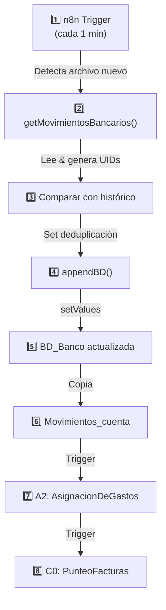

# Referencia de Scripts Google Apps Script

## 📍 Mapa de Scripts

### Estructura de Carpetas

```
workflows/
└── CaixaB$-Scripts/
    └── AppScripts/
        ├── ConstantesGlobales.gs
        ├── ImportarMovimientos/
        │   ├── importarMovimientos.gs (V1)
        │   └── importarMovimientosV2.gs (V2 optimizada)
        ├── ArchivarMovimientos/
        │   ├── ArxivarMovimientos.gs
        │   └── [Documentación sesiones]
        └── Python/
            └── ImportarMovimientos/
                └── [Scripts alternativas Python]
```

---

## 🔗 Vincular Script → Componente

| Script | Componente | Propósito | Referencia |
|--------|-----------|----------|-----------|
| `ConstantesGlobales.gs` | **Global** | Variables globales compartidas | [[ConstantesGlobales]] |
| `importarMovimientos.gs` | **A1** | Importar movimientos bancarios | [[A1_ImportarMovimientos_Implementacion]] |
| `importarMovimientosV2.gs` | **A1** | Versión optimizada de A1 | [[A1_ImportarMovimientos_Implementacion]] |
| `ArxivarMovimientos.gs` | **H1** | Archivar y organizar facturas | [[H1_ArchivoRegistro_Implementacion]] |

---

## 📝 Script Activo: importarMovimientos.gs

### Ubicación
```
workflows/CaixaB$-Scripts/AppScripts/ImportarMovimientos/importarMovimientos.gs
```

### Componente Relacionado
→ [[A1_ImportarMovimientos_Implementacion]]

### Funciones Principales

| Función | Propósito | Entrada | Salida |
|---------|----------|---------|--------|
| `getMovimientosBancarios()` | Leer archivo de Drive y generar UIDs | `idCarpetaDrive` | Array con UIDs |
| `appendBD()` | Deduplicar e importar en BD_Banco | UIDs nuevas vs históricas | Filas agregadas |

### Configuración

```javascript
// VARIABLES A AJUSTAR POR AMBIENTE
let idCarpetaDrive = "1QL47EotyHLz4xhEssWw_MWIAvqDKcsg1"
// → ID de carpeta Drive donde están los extractos

let filaInicioDatosImportados = 4
// → Fila donde empieza el contenido (ajustar por banco)
```

### Integración con Workflows n8n

**Trigger**: [[wf_A1_ImportarMovimientos]]
- n8n detecta archivos nuevos en Drive cada minuto
- Ejecuta esta función Google Apps Script
- A1 agrega movimientos a BD_Banco
- Dispara A2 automáticamente

### Rendimiento

| Métrica | Benchmark |
|---------|-----------|
| Tiempo lectura (100 filas) | ~2 segundos |
| Generación UIDs | ~1 segundo |
| Deduplicación | ~1 segundo |
| Append en BD | ~2 segundos |
| **Total** | **~6 segundos** |

---

## 📝 Script Alternativo: importarMovimientosV2.gs

### Mejoras vs V1

- ✅ Optimización de deduplicación con Set
- ✅ Mejor manejo de errores
- ✅ [Ver detalle en archivo]

### Cuándo usar V2

✅ **Usar V2 si**:
- >500 filas históricas
- Importaciones frecuentes (>3/día)
- Necesitas mejor control de errores

✅ **Seguir con V1 si**:
- <100 filas/mes
- Importaciones puntuales
- Scripts simples preferibles

---

## 🔐 ConstantesGlobales.gs

### Propósito
Centralizar variables reutilizadas en múltiples scripts

### Qué contiene
```javascript
// URLs, IDs, referencias de sheets
// Credenciales (si las hay)
// Configuración global
```

### Referencia
→ [[ConstantesGlobales]]

---

## 📚 Documentación de Sesiones

### Informes de Optimización

| Archivo | Fecha | Tema | Estado |
|---------|-------|------|--------|
| `Informe_Sesion_OptimizacionCargaGlobal_2026-09-02.md` | 2026-09-02 | Aislamiento API, variables perezosas | ✅ Implementado |
| `informesSesionClaude.md` | Histórico | Sesiones varias de Claude | 📚 Referencia |

**Ubicación**: `workflows/CaixaB$-Scripts/AppScripts/ArchivarMovimientos/`

---

## 🔄 Ciclo de Vida del Script



---

## 🐛 Mantenimiento

### Logs & Debugging

Acceder en Google Apps Script Editor:
1. Abre el proyecto GAS
2. Ejecuta `appendBD()`
3. Ve a "Execution Log" para ver resultados
4. Busca errores en la salida

### Common Issues

| Problema | Causa | Solución |
|----------|-------|----------|
| "Rango fuera de límites" | No hay espacio en BD | Aumentar filas en sheet |
| "Archivo no encontrado" | Drive ID cambió | Actualizar `idCarpetaDrive` |
| "UIDs duplicadas" | Encoding de caracteres | Normalizar caracteres especiales |

---

## 📊 KPIs de Monitoreo

Según [[Metricas_Detalladas]] sección 1:

- **Tasa importación correcta**: >99%
- **Tasa incidencias por formato**: <5%
- **Tasa duplicados**: <1%

**Dónde ver**:
- Google Sheets: Columna de UID en BD_Banco
- Logs: Google Apps Script Execution panel
- Dashboard: [[KPIs_Sistema]] (actualización mensual)

---

## 🔧 Próximos Pasos

### Mejoras Planeadas

1. **Soporte multi-archivo**: Procesar múltiples bancos simultáneamente
2. **Validación de formato**: Rechazar archivos malformados antes de importar
3. **Notificaciones**: Alertas en Slack si importación falla
4. **Rollback automático**: Revertir cambios si duplicados exceden umbral

### Para Implementar

- Crear `A1_ImportarMovimientos_Mejorado.md` con specs de mejoras
- Documentar cambios antes de implementar
- Versionar scripts con control de cambios

---

## 🔗 Notas Relacionadas

- [[A1_ImportarMovimientos]] → Descripción funcional de A1
- [[A1_ImportarMovimientos_Implementacion]] → Detalles técnicos profundos
- [[Formulas_Google_Sheets]] → Fórmulas con UIDs
- [[Metricas_Detalladas]] → KPIs de A1
- [[03_BDs_Principales]] → Estructura de BD_Banco
- [[wf_A1_ImportarMovimientos]] → Flujo n8n que dispara A1

---

**Última actualización**: 2026-09-10
**Responsable técnico**: DevOps / Google Apps Script
**Frecuencia de revisión**: Mensual (o cuando hay cambios en importación)
**Versionado**: V1 (importarMovimientos.gs), V2 (importarMovimientosV2.gs)
