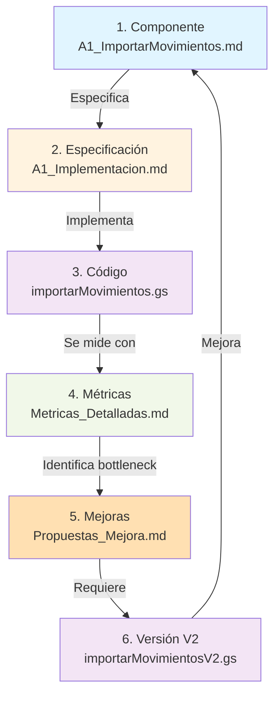

# Trazabilidad: Código ↔ Documentación

## 📌 Objetivo

Este documento mapea la relación bidireccional entre:
- **Scripts técnicos** (Google Apps Script, Python, JSON n8n)
- **Documentación conceptual** (arquitectura, componentes, métricas)
- **Mejoras propuestas** (roadmap, optimizaciones)

Permite trazabilidad completa: puedes partir de un error en logs y llegar a la documentación relevante, o viceversa.

---

## 🔗 Mapeo A1: Importar Movimientos Bancarios

### 1️⃣ Código

**Ubicación**: `workflows/CaixaB$-Scripts/AppScripts/ImportarMovimientos/`

```
importarMovimientos.gs
├─ getMovimientosBancarios()
│  ├─ Lee Drive (idCarpetaDrive)
│  ├─ Genera UIDs
│  └─ Invierte orden
└─ appendBD()
   ├─ Deduplicación
   ├─ Append BD_Banco
   └─ Append Movimientos_cuenta
```

### 2️⃣ Documentación Conceptual

**Componente**: [[A1_ImportarMovimientos]]
- 🎯 Objetivo
- 📋 Descripción del proceso
- 🔄 Flujo en n8n
- 📊 Datos (entrada/salida)
- ⚙️ Configuración
- 🐛 Desafíos conocidos

### 3️⃣ Documentación Técnica

**Implementación**: [[A1_ImportarMovimientos_Implementacion]]
- ⚙️ Variables globales
- 🔐 Algoritmo de UID
- 🗂️ Deduplicación con Set
- 🐛 Errores potenciales
- 📊 Métricas de éxito
- 📝 Debugging

### 4️⃣ Fórmulas Relacionadas

**Referencia**: [[Formulas_Google_Sheets#uid-generation]]
- Patrón de UID: `FechaValor_FechaOp_Proveedor_MasData_Debe_Haber`
- Separador: `'_'`
- Formato decimal español (coma)

### 5️⃣ Métricas & KPIs

**Seguimiento**: [[Metricas_Detalladas#1%EF%B8%8F%E2%83%A3-kpi-de-importaci%C3%B3n-bancaria-a1]]

| KPI | Target | Cómo medir |
|-----|--------|-----------|
| Tasa importación | >99% | (Filas OK / Total) × 100 |
| Tasa incidencias | <5% | (Archivos con error / Total) × 100 |
| Tasa duplicados | <1% | (UIDs duplicadas / Total) × 100 |

### 6️⃣ Workflows n8n

**Orquestación**: [[wf_A1_ImportarMovimientos]]
- Trigger: Detectar archivo nuevo en Drive
- Ejecuta: `importarMovimientos.gs` → `appendBD()`
- Resultado: Movimientos en BD_Banco
- Cascada: Inicia A2 → C0

### 7️⃣ Mejoras Propuestas

**Roadmap**: [[Propuestas_Mejora#iniciativas-críticas]]
- ⭐ Soporte multi-banco simultáneo
- ⭐ Validación formato antes de importar
- ⭐ Notificaciones Slack en errores

### 8️⃣ Índice de Referencia

**Master Index**: [[Scripts_GoogleAppsScript_Referencia]]
- Mapeo de scripts a componentes
- Ubicaciones de archivos
- Versiones (V1, V2)

---

## 🔀 Flujo de Trazabilidad en 4 Direcciones

### ➡️ Dirección 1: Código → Problema

```
❌ Error en logs: "RangeError: Rango fuera de límites"
  ↓
📄 Archivo: importarMovimientos.gs línea 78
  ↓
🔍 Función: appendBD() → getRange(lastRow+1)
  ↓
📚 Referencia: [[A1_ImportarMovimientos_Implementacion#error-1-rango-lastrow1-fuera-de-límites]]
  ↓
✅ Solución: "Aumentar filas en sheet"
  ↓
📊 Métrica afectada: Tasa de importación correcta (KPI A1)
```

### ⬅️ Dirección 2: Problema → Código

```
❌ Problema: "Tasa duplicados sube de 1% a 5%"
  ↓
📊 Métrica: [[Metricas_Detalladas#tasa-de-incidencias-por-formato]]
  ↓
🔍 Análisis: "Revisar lógica de UID"
  ↓
📚 Referencia: [[A1_ImportarMovimientos_Implementacion#algoritmo-de-uid]]
  ↓
📄 Archivo: importarMovimientos.gs líneas 45-60 (const uids = ...)
  ↓
✅ Root cause: Encoding de caracteres (ñ, á, é)
  ↓
🛠️ Fix: Normalizar con `.normalize("NFD")`
```

### ⬆️ Dirección 3: Código → Mejora

```
📄 Script: importarMovimientos.gs
  ├─ Lee solo 1 archivo (.next())
  └─ ⚠️ Limitación: No soporta multi-banco
  ↓
🔍 Mejora identificada: [[Propuestas_Mejora#iniciativa-multi-banco]]
  ↓
📊 Impacto: 
  ├─ Reducción tiempo: 5 min → 30 seg (6x más rápido)
  ├─ Reducción manual: 10% → 2%
  └─ Costo implementación: 4 horas
  ↓
✅ ROI: ((5 min - 0.5 min) × €50 × 250 días) / (4 horas × €80) = 92x retorno
```

### ⬇️ Dirección 4: Mejora → Código

```
💡 Mejora propuesta: [[Propuestas_Mejora#soporte-multi-archivo]]
  "Procesar múltiples bancos simultáneamente"
  ↓
🔧 Cambio técnico requerido:
  └─ Función: Reescribir getMovimientosBancarios()
     - Cambiar de .next() a .get() para array completo
     - Loop en cada archivo
     - Agregar validación formato
  ↓
📝 Documentación a actualizar:
  ├─ importarMovimientosV3.gs (nuevo)
  ├─ [[A1_ImportarMovimientos_Implementacion]] (versión V3)
  ├─ [[Metricas_Detalladas]] (nuevo benchmark)
  └─ [[Propuestas_Mejora]] (marcar como ✅ Completado)
  ↓
📊 Validación: Medir KPI A1 post-cambio
  └─ Target: Tasa importación aún >99%, pero tiempo <2 seg
```

---

## 📊 Matriz de Trazabilidad Completa

### A1 — Importar Movimientos Bancarios

| Elemento | Ubicación | Tipo | Relación |
|----------|-----------|------|----------|
| **Código** | `importarMovimientos.gs` | Script GAS | Implementación |
| **Función principal** | `appendBD()` | Código | ← Ejecuta |
| **Componente** | [[A1_ImportarMovimientos]] | Doc | ← Describe |
| **Implementación** | [[A1_ImportarMovimientos_Implementacion]] | Doc técnica | ← Detalla |
| **Fórmula UID** | [[Formulas_Google_Sheets]] | Fórmulas | ← Referencia |
| **KPIs** | [[Metricas_Detalladas#1]] | Métricas | ← Mide |
| **Workflow** | [[wf_A1_ImportarMovimientos]] | n8n | ← Orquesta |
| **Referencia scripts** | [[Scripts_GoogleAppsScript_Referencia]] | Índice | ← Mapea |
| **Mejoras** | [[Propuestas_Mejora]] | Roadmap | ← Evoluciona |

---

## 🔄 Ciclo de Vida Documentación ↔ Código



---

## 🎯 Cómo Usar Esta Trazabilidad

### Si tengo un ERROR en logs

1. Toma el error: `"RangeError: Rango fuera de límites"`
2. Busca en [[A1_ImportarMovimientos_Implementacion#🐛-errores-potenciales]]
3. Encuentra la solución → Aplica fix
4. Verifica en [[Metricas_Detalladas]] que KPI se recuperó

### Si tengo un KPI bajo

1. Toma métrica: `"Tasa duplicados = 3%"`
2. Ve a [[Metricas_Detalladas#tasa-de-incidencias-por-formato]]
3. Sigue análisis profundo → Identifica causa en código
4. Abre [[A1_ImportarMovimientos_Implementacion]] → Busca bug
5. Implementa fix en `importarMovimientos.gs`

### Si veo un BOTTLENECK

1. Identifica en [[Metricas_Detalladas]] qué es lento
2. Ve a [[A1_ImportarMovimientos_Implementacion#rendimiento]]
3. Propón mejora en [[Propuestas_Mejora]]
4. Abre issue en código: `importarMovimientos.gs`
5. Documenta en `importarMovimientosV3.gs`

### Si quiero MEJORAR el sistema

1. Lee [[Propuestas_Mejora#iniciativas-críticas]]
2. Selecciona iniciativa (ej: "Multi-banco")
3. Ve a [[A1_ImportarMovimientos_Implementacion]] para contexto técnico
4. Diseña cambio
5. Documenta en versión nueva (`importarMovimientosV3.gs`)
6. Actualiza [[A1_ImportarMovimientos]] con nueva descripción
7. Mide impacto en [[Metricas_Detalladas]]

---

## 📋 Checklist para Cambios

Cuando modificas código de un componente:

- [ ] **Actualizar código**: `importarMovimientos.gs` (o V3)
- [ ] **Documentar técnicamente**: [[A1_ImportarMovimientos_Implementacion]]
- [ ] **Actualizar componente**: [[A1_ImportarMovimientos]]
- [ ] **Revisar fórmulas**: [[Formulas_Google_Sheets]] si aplica
- [ ] **Actualizar métricas**: [[Metricas_Detalladas]]
- [ ] **Revisar workflow**: [[wf_A1_ImportarMovimientos]]
- [ ] **Validar referencias**: [[Scripts_GoogleAppsScript_Referencia]]
- [ ] **Roadmap**: ✅ Marcar como completado en [[Propuestas_Mejora]]

---

## 🔗 Notas Relacionadas

- [[A1_ImportarMovimientos_Implementacion]] → Detalles técnicos de A1
- [[Scripts_GoogleAppsScript_Referencia]] → Índice de todos los scripts
- [[Metricas_Detalladas]] → Cómo medir el éxito de A1
- [[Propuestas_Mejora]] → Qué mejoras se planean
- [[00_MOC_Norgenic_Financiera]] → Índice maestro

---

**Última actualización**: 2026-09-10
**Propósito**: Facilitar debugging, mejoras y mantenimiento
**Audiencia**: Desarrolladores, DevOps, Finance Operations
**Frecuencia de revisión**: Cada cambio importante en código
